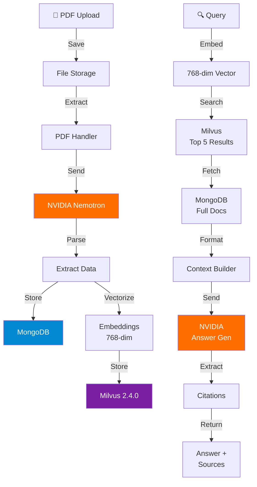

# 📄 PDF Information Extractor & RAG Chatbot

AI-powered PDF extraction and semantic search using NVIDIA Nemotron-3, MongoDB, and Milvus vector database.

## 🎯 Features

- **PDF Extraction**: Extracts summary, eligibility, benefits, dates, application process using NVIDIA AI
- **MongoDB Storage**: Stores all extracted data with full metadata
- **Vector Search**: 768-dim embeddings with semantic similarity (Milvus + sentence-transformers)
- **RAG Chatbot**: Query documents with AI-generated answers and automatic citations
- **Web Dashboard**: Upload, manage, and view extracted data

## ⚡ Quick Start

### 1. Prerequisites
- Python 3.8+ with pip
- MongoDB (local or Atlas cloud)
- NVIDIA API key: https://developer.nvidia.com/ai-api
- Milvus 2.4.0 running on `localhost:19530`

### 2. Install & Setup
```bash
# Clone/Navigate to project
cd d:\HACKTHON\nvidianemotron

# Create virtual environment (Windows)
python -m venv .venv
.\.venv\Scripts\Activate.ps1

# Install dependencies
pip install -r requirements.txt

# Configure environment
cp .env.example .env
# Edit .env with: MONGODB_URI, NVIDIA_API_KEY, etc.

# Run app
streamlit run app.py
```
Opens at: `http://localhost:8501`

## 📋 Usage

### Upload & Extract
1. Go to "Upload & Extract" page
2. Select PDF → Click "Process PDF"
3. Review extracted data in tabs
4. Save to database → Auto-generates embedding

### Generate Embeddings
- Click **"🧠 Generate Embedding"** button for each document
- Required for chatbot search to work

### Chat with Documents
1. Go to "💬 Chatbot" page
2. Ask questions in natural language
3. AI searches documents and answers with citations

## 📁 Project Structure

```
nvidianemotron/
├── app.py                    # Main Streamlit UI
├── rag_chatbot.py            # RAG search & answer generation
├── milvus_handler.py         # Vector database operations
├── mongodb_handler.py        # Document storage
├── embedding_utils.py        # Vector generation (sentence-transformers)
├── chatgpt_extractor.py      # NVIDIA Nemotron API
├── pdf_handler.py            # PDF processing
├── config.py                 # Settings
├── logger_config.py          # Logging setup
├── requirements.txt          # Dependencies
├── .env.example              # Environment template
└── uploaded_pdfs/            # Local PDF storage
```

## 🏗️ Architecture



## 🔧 Environment Setup

**Key Variables** (set in `.env`):
```
MONGODB_URI=mongodb://localhost:27017
MONGODB_DB_NAME=pdf_extraction_db
NVIDIA_API_KEY=your_key_here
NVIDIA_MODEL=nvidia/nemotron-3-super-120b-a12b
```

**Milvus Setup**:
```bash
# Start Milvus with Docker
docker run -d -p 19530:19530 -p 9091:9091 milvusdb/milvus:latest milvus run standalone
```

**MongoDB**:
- Local: `mongodb://localhost:27017`
- Atlas: Create account at https://www.mongodb.com/cloud/atlas

## 🐛 Troubleshooting

### Milvus Connection Error
```bash
# Ensure Milvus is running
docker ps | grep milvus

# Start Milvus if needed
docker run -d -p 19530:19530 -p 9091:9091 milvusdb/milvus:latest milvus run standalone
```

### Chatbot Returns No Results
1. **Generate embeddings**: Click "🧠 Generate Embedding" on "View Extracted Data" page
2. Without embeddings, Milvus collection is empty
3. Check logs for: "Number of embeddings > 0"

### Pymilvus 2.4.0 API Issues
```
Error: search() got unexpected keyword argument 'params'
Fix: Uses 'param=' (singular), not 'params='
```
Already pinned in requirements.txt - reinstall: `pip install --upgrade -r requirements.txt`

### PDF Extraction Issues
- Use text-based PDFs (not scanned images)
- Check NVIDIA API key is valid
- Monitor rate limits on NVIDIA dashboard

### Port 8501 Already in Use
```bash
streamlit run app.py --server.port 8502
```

## 📊 Database Schema

**MongoDB Document** (extracted_data collection):
```json
{
  "_id": "ObjectId",
  "filename": "document.pdf",
  "num_pages": 12,
  "created_at": "timestamp",
  "extracted_info": {
    "summary": "...",
    "eligibility": ["...", "..."],
    "benefits": ["...", "..."],
    "apply_date": "2024-12-31",
    "application_process": ["Step 1", "Step 2", ...]
  }
}
```

**Milvus Collection** (pdf_embeddings):
- `pk`: Auto-generated ID
- `doc_id`: Reference to MongoDB document
- `summary`: Text summary
- `embedding`: 768-dimensional vector

## 💡 Tips

✅ Always generate embeddings after extraction  
✅ Use natural language queries for semantic search  
✅ Check MongoDB for documents before chatting  
✅ Enable DEBUG logging to see search scores  
✅ Test with simple queries first  

## 📚 Documentation

- [Streamlit](https://docs.streamlit.io)
- [MongoDB](https://docs.mongodb.com)
- [NVIDIA API](https://docs.api.nvidia.com)
- [Milvus](https://milvus.io/docs)
- [sentence-transformers](https://www.sbert.net/)

---

**Ready to extract and search PDFs? 🚀**
